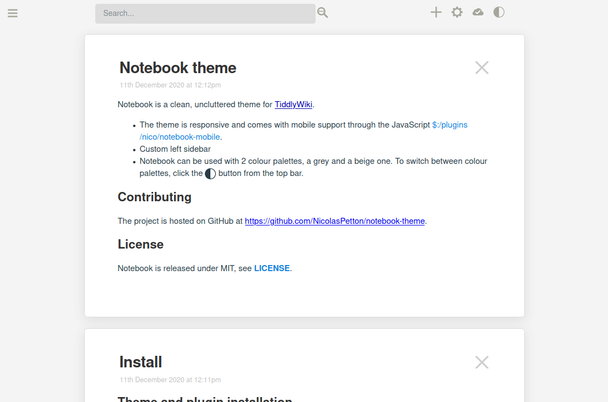
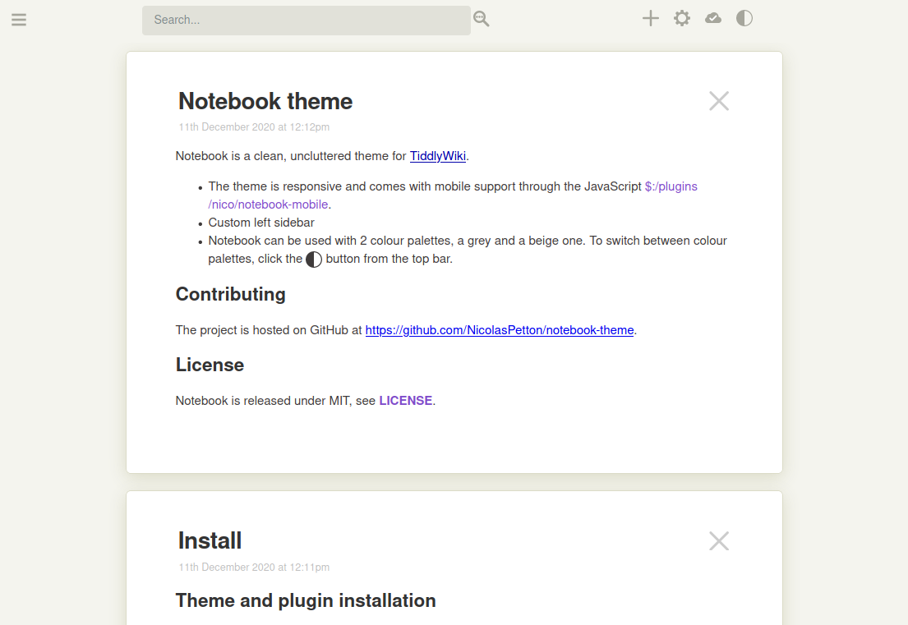

# Notebook

Notebook is a clean, uncluttered theme for TiddlyWiki.

- The theme is responsive and comes with mobile support through the included
  `notebook-mobile` plugin.
- Notebook can be used with 2 colour palettes, a grey and a beige one. To switch
  between colour palettes, click the color palette switch button in the top bar.

## Demo & Screenshots

A demo is available at
[nicolas.petton.fr/tw/notebook.html](https://nicolas.petton.fr/tw/notebook.html).

## Installation

See https://nicolas.petton.fr/tw/notebook.html

## License

Notebook is released under the MIT license. See [LICENCE](./LICENSE).
